## 欢迎来到Enigma！从这里开始.
原文：[Welcome to Enigma! Start Here.](https://blog.enigma.co/welcome-to-enigma-start-here-e65c8c9125ef)  
翻译：王兵、高天尧、程冠杰  
校对：李其柄

在Enigma中，我们正努力实现去中心化互联网的愿景。 这份介绍指南完整地阐述了Enigma项目的发展和我们团队的相关信息。

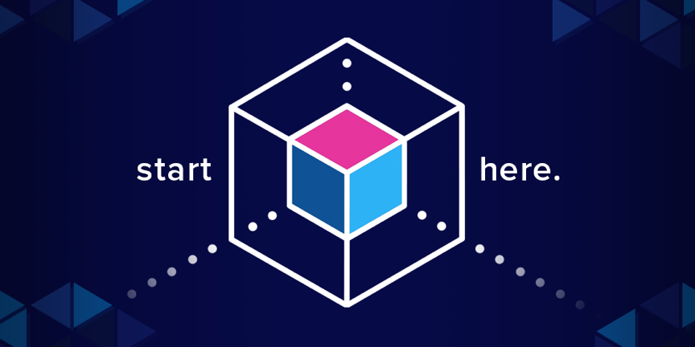

  
欢迎来到Enigma博客！无论您是从2015年的最初阶段开始关注到了我们的项目，还是从现在开始学习Enigma的隐私方案，我们都希望您能够轻松搜索我们的文章、资源和代码。

在这篇博文中，您将可以看到有关Enigma所有内容的目录，例如团队和代币分发情况。我们还将分享一些资源帮助您追踪和参与到我们的项目、协议和社区。 Enimga团队将不断维护更新这篇博文和文档目录。

 

[[video](https://www.youtube.com/watch?v=qeJn8YgDIlw)]

  
### 目录

- [什么是Enigma协议以及它如何工作？](#id1)

- [你能用Enigma构建什么？](#id2)

- [Enigma节点和ENG代币](#id3)

- [Enigma的隐私技术](#id4)

- [团队、社区和Enigma Collective](#id5)

- [Enigma的未来](#id6)

- [Decentralize This！博客节目](#id7)

### 1. 什么是Enigma协议以及它如何工作？

> "我们从2015年开始解决隐私和扩展性问题，在此之前很多人已经知道什么是区块链，并且也知道区块链未来可能的样子...Enigma是去中心化世界里最具雄心且最重要的项目之一 —— 它正是实现去中心化的、更加可持续的未来的所缺失的一环。"
>
> —— 盖伊·泽斯金德，Enigma CEO与联合创始人

[Enigma](http://enigma.co/)在为去中心化网络搭建一个隐私层。Enigma起源于MIT的研究，它的[隐私结点](https://blog.enigma.co/secret-nodes-exploring-staking-stakeholders-and-eng-d69a68e3d0fd)网络能够在加密的、规模化的数据上进行计算，而不会暴露原始数据本身。最终，若去中心化应用可接受并使用隐私和敏感数据进行计算，用Enigma构建的智能合约将变成 ["隐私合约"](https://blog.enigma.co/defining-secret-contracts-f40ddee67ef2)，这将促进开发者们创建数千种新型且极具价值的解决方案。

[区块链从设计本身就不擅长保护隐私](https://blog.coinmarketcap.com/2018/10/09/privacy-for-blockchains-an-introduction/) —— 这导致的结果就是传统智能合约受到严重限制。它们不能用于接收需要保密的数据。**Enigma正在构造首个可扩展的去中心化应用平台，允许dApps接收隐私或敏感数据作为输入**。隐私合约能解锁dApps的巨大潜力，并且能够革新诸如金融、信贷、博彩、机器学习以及医疗健康等各种依赖于使用隐私数据的产业。它们也有助于将数据权力返回给个人。

它是如何工作的？我们的[协议](https://blog.enigma.co/protocol)会将敏感数据分成多个部分，并将它们以加密的形式分发给多个Enigma网络结点。结点能够使用这些数据来执行计算，且无需看到原始数据或者暴露这些原始数据本身。除了提供数据隐私外，Enigma还解决了可扩展性问题。**我们相信未来第一个有百万用户的去中心化应用将通过Enigma来构建 —— Enigma正是去中心化未来的所缺失的重要一环**。

Enigma首次出现在2015年我们的CEO和联合创始人盖伊·泽斯金德的[MIT论文](https://enigma.co/enigma_full.pdf)，这是基础白皮书 [“去中心化隐私”](https://enigma.co/ZNP15.pdf)的前身。这两篇关于隐私和区块链的开创性的论文现在是该领域有最多引用的文章，超过500个综合引用。**令人骄傲地是，我们是第一个认识到隐私解决方案的本质正是去中心化应用成功关键所在的项目** —— 并且我们也很自豪能够持续在这个方向做出关键性的努力。同时这些白皮书也在很早期的时候探讨了可扩展性解决方案，即将共识验证共识和计算分离。

Enigma致力于开放性和包容性。我们是无需许可的开放网络，并且我们以开源的方式在构建。我们的[公开测试网](https://blog.enigma.co/protocol) 已经可以使用，更多更新在持续发布。你可以在本文阅读更多迄今为止我们的进展和即将进行的的优先事项：

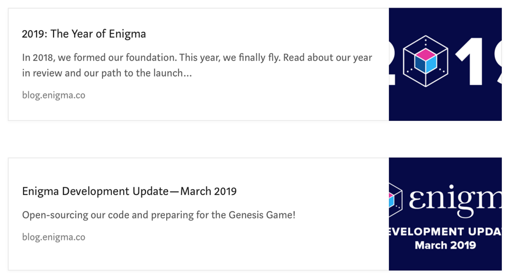

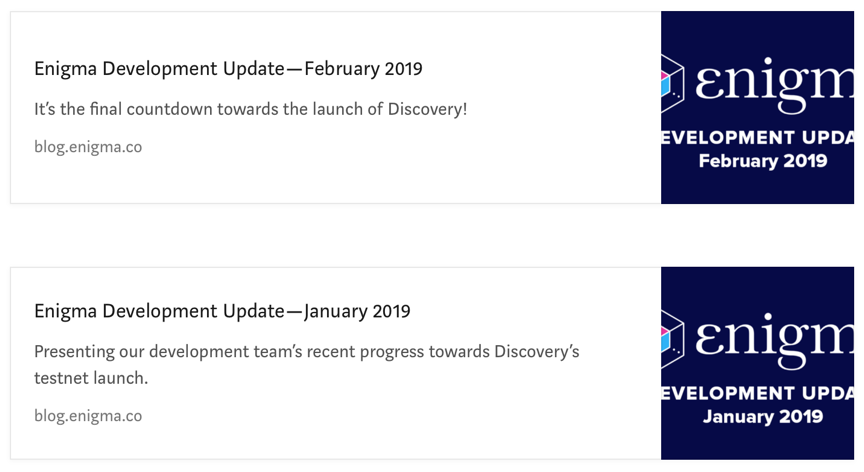

[[2019：Engima元年](https://blog.enigma.co/2019-the-year-of-enigma-cef8d10366a1)]

[[Enigma开发进展更新：2019.3](https://blog.enigma.co/enigma-development-update-march-2019-74b6c1557d28)]

[[Enigma开发进展更新：2019.2](https://blog.enigma.co/enigma-development-update-february-2019-2dad12152177)]

[[Enigma开发进展更新：2019.1](https://blog.enigma.co/enigma-development-update-january-2019-1f4996a75bdf)]

更多相关博客文章：

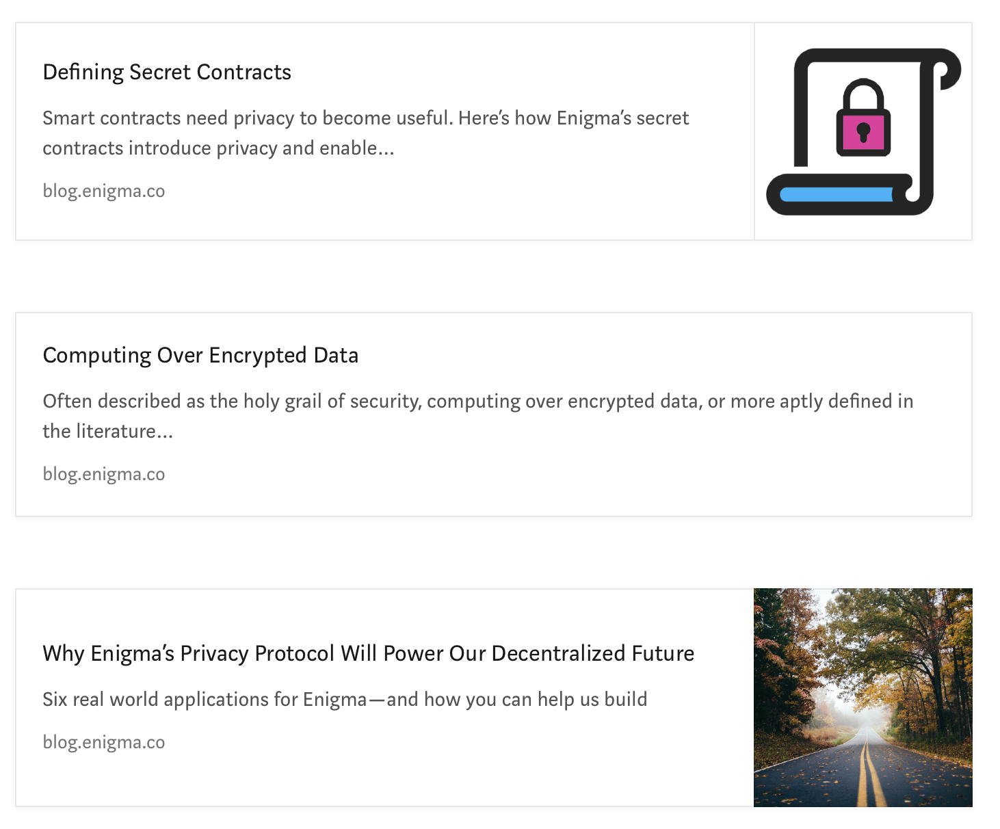

[[定义隐私合约](https://blog.enigma.co/defining-secret-contracts-f40ddee67ef2)]

[[在加密数据上执行计算](https://blog.enigma.co/computing-over-encrypted-data-d36621458447)]

[[为什么Enigma的隐私协议将驱动去中心化的未来](https://blog.enigma.co/why-enigmas-privacy-protocol-will-power-our-decentralized-future-aedb8c9ee2f6)]

### 2. 你能用Enigma构建什么？

Enigma是一个极其灵活的多功能平台。它可以在当今的数字时代用来解决一些最迫切的挑战。为了凸显这些挑战，我们创建了[Enigma Solutions](https://blog.enigma.co/solutions/home)专栏，来浅显易懂地帮助理解Enigma的使用方式与应用场景。

在这个专栏里你可以了解Enigma如何使[隐私拍卖](https://blog.enigma.co/secret-auctions-with-enigma-83647a141fb5)可能、如何实现[去中心化信誉积分系统](https://blog.enigma.co/decentralizing-credit-with-enigma-440c6648b4d8)、如何实现[用TCRs做安全投票](https://blog.enigma.co/private-voting-for-tcrs-with-enigma-b441b5d4fa7b)、如何确保[DMS](https://blog.enigma.co/tell-no-tales-decentralizing-a-dead-mans-switch-6217e2f4361b)的安全问题以及如何[让你成为一个(隐私不受侵犯的)人类](https://blog.enigma.co/bot-or-not-f7108200738d)。**[近期，我们公布了8个使用Enigma协议来构建这些重要解决方案的初始伙伴](https://blog.enigma.co/introducing-the-enigma-launch-partners-642336f752cc)**。我们在[Devcon4](https://www.pscp.tv/w/1LyGByezgbyKN)上展示了一个“隐私投票”的demo，现在已经部署在Enigma测试网络中。

相信在更加去中心化的未来世界中，Enigma也为数据隐私和所有权问题提供了指导意义。我们之前也已经分析过[GDPR合规](https://blog.enigma.co/gdpr-and-enigma-were-updating-blockchain-s-privacy-policy-d245ab00da07)并且阐述了Enigma如何能够阻止下一个[剑桥分析事件](https://blog.enigma.co/why-blockchain-alone-cant-fix-facebook-fbd9510b36f5)。

在加密货币领域，Enigma协议也有非常重要的应用场景，例如[隐私安全的ICO](https://blog.enigma.co/secret-icos-and-privacy-tokens-d77ed505514d)和去中心化中继器来防治"front-running"问题。

上述的解决方案仅仅只是部分！你可以在[我们的开发者论坛](https://forum.enigma.co/)上贡献你对于可用Enigma协议构造的潜在应用的想法。

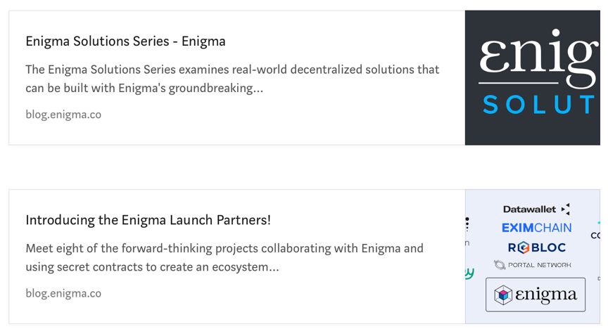

#### 2.1 如何用Enigma构建隐私应用？

在2018年6月，Enigma在dockerized环境中发布了我们的第一个[功能测试网](https://medium.com/m/global-identity?redirectUrl=https%3A%2F%2Fblog.enigma.co%2Fthe-code-is-here-announcing-enigma-testnet-1-0-release-accdaf051950),[代码](https://github.com/enigmampc/enigma-docker-network-deprecated)可以在我们的GitHub上找到。我们还为使用无法兼容SGX设备的开发人员发布了[模拟模式](https://blog.enigma.co/enigma-testnet-update-simulation-mode-is-now-active-cdecf07fe2ac)。我们提供了与Solidity和以太坊网络的开箱即用的互操作性。

如果您对使用Enigma进行开发感兴趣，请阅读我们的[入门指南](https://blog.enigma.co/getting-started-with-the-enigma-protocol-a-complete-developers-guide-170b7dfa5c0f)，并查看我们的[开发人员文档](http://enigma.co/protocol/)，从而获取您需要的所有帮助。

如果您有任何疑问并希望与社区中的某些人或Enigma团队进行交流，您可以访问我们的开发人员论坛[forum.enigma.co](https://forum.enigma.co)并提出要求！

最后，如果您已经在开展项目并且认为Enigma将在您的开发栈中起到作用，请填写此[公司表](https://airtable.com/shraD9Oo5HPmRR9eE) - 我们总是很高兴与其他建造者合作！

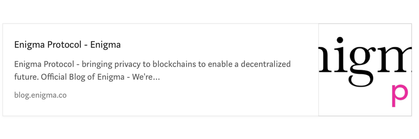

#### 2.2 不断增长的Enigma生态

Enigma的设计总是考虑了终端用户。我们不仅仅是一个学术项目 —— 我们希望为个人和机构建立一个可大规模运行的平台。我们希望在每个阶段确保我们正在解决的是世界上真实确切的问题，并且我们已经在尝试一些迫切需要数据隐私和可扩展性的惊人项目。

我们的重要合作伙伴之一是我们与[英特尔的合作](https://medium.com/m/global-identity?redirectUrl=https%3A%2F%2Fblog.enigma.co%2Fannouncing-enigmas-collaboration-with-intel-43bbf73a86a7)，其中概述了Enigma如何直接与英特尔合作，并利用英特尔的SGX飞地大幅提高隐私计算的速度和性能。我们也是企业以太坊联盟(EEA)和去中心化身份基金会的[成员](https://blog.enigma.co/enigma-joins-enterprise-ethereum-alliance-and-decentralized-identity-foundation-5c765eaad907?gi=84f1f4e95de0)，专注于构建真正的解决方案。我们也是[英特尔Ingenuity](https://www.intel.co.uk/content/www/uk/en/partner/ingenuity-partner/about.html)的合作伙伴和[MIT STEX 25](https://blog.enigma.co/enigma-part-of-mit-stex25-652e0580ee1f)的成员。

>来自STEX25网站：“STEX25初创公司已被定位为特别的产业合作伙伴。这些年轻且充满活力的公司已经证明了自己的早期使用案例、客户、演示或合作伙伴关系，并可能处于显着增长的尖端。“

**想使用我们的协议构建应用？**在此提交您的[申请表](https://airtable.com/shraD9Oo5HPmRR9eE)。

**想帮助我们构建Enigma生态系统的关键部分吗？**立即申请[Enigma Growth Grant(EGG)](https://blog.enigma.co/announcing-eggs-enigma-growth-grants-c61d985b670e)！

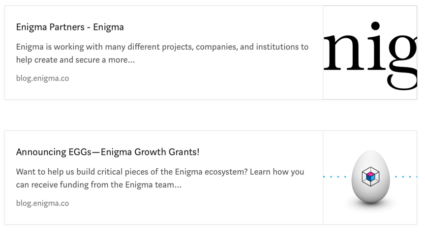

### 3. Enigma节点和ENG代币

Enigma将隐私计算从区块链上移除了，这类计算将会在Enigma本身的计算结点网络上执行。这样做，Enigma可以同时解决可扩展性和隐私问题。

在Enigma网络上的计算费用会用ENG代币支付，这些费用用来给执行隐私计算和达成状态共识的结点提供经济上的奖励。Enigma的[隐私结点](https://blog.enigma.co/secret-nodes-exploring-staking-stakeholders-and-eng-d69a68e3d0fd)与主节点相似，都需要抵押一定的ENG代币，以确保计算能够正确执行同时确保网络完好。抵押的代币越多，结点能够被选中执行计算的概率越大，这样就能收到更多计算费用。ENG代币可以看作以太协议上的Gas代币：用户向结点支付Gas来执行计算。隐私结点最少需要抵押25,000个ENG。

主网上的隐私结点会在测试网运行期间选择，这个时间段被称之为**创世游戏**。在这段时间内，具有最多抵押测试代币和最长运行时间的结点将成为**创世结点**。如果你对运行隐私结点感兴趣，请仔细阅读下面的文章。

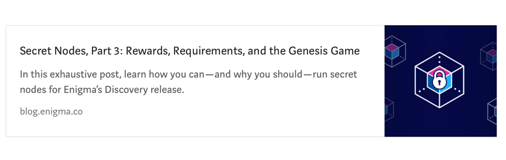

[[秘密结点，第三部分：奖励，要求和创世游戏](https://blog.enigma.co/secret-nodes-part-3-rewards-requirements-and-the-genesis-game-cfbe81dad455)]

随着Enigma沿着它的路线图向前推进，结点将会分成两个类型，列举如下(进一步的细节将在这篇文章中扩展更多 [探索Enigma结点和抵押](https://blog.enigma.co/secret-nodes-exploring-staking-stakeholders-and-eng-d69a68e3d0fd))：

*隐私结点*：隐私结点是网络的参与者，运行在Enigma的网络上用于确保隐私合约在保护隐私的情况下运行。Enigma网络上的结点与在比特币网络上的矿工类似。

*共识结点*：共识结点将运行Enigm区块链本身 —— 它们验证计算并确定状态改变的最终顺序。(在第一版本，Discovery里，这个类型的结点还没实现，现在依赖以太坊验证。)

请填写这个[意向表格](https://airtable.com/shrCCgrSgDhZPTorG)成为我们隐私结点邮件列表的一分子。你也可以在我们的[开发者论坛](https://forum.enigma.co/signup)中发表见解，或者加入我们的[社区电报群](https://t.me/secretnodes)

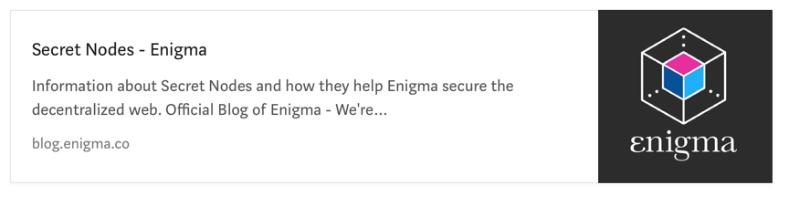

[[秘密结点 —— Enigma](https://blog.enigma.co/secretnodes/home)]

### 4. Enigma的隐私技术

如前所述，Enigma旨在结合使用加密隐私技术（如安全多方计算）和基于硬件的隐私技术（可信执行环境）。鉴于我们在sMPC（可以追溯到我们的原始白皮书）领域的专业知识以及我们与[英特尔](https://blog.enigma.co/announcing-enigmas-collaboration-with-intel-43bbf73a86a7)在安全硬件和隐私保护技术方面的持续合作，我们的团队能够有效地利用这两种技术。以下是我们在[CoinMarketCap](https://blog.coinmarketcap.com/2018/10/09/privacy-for-blockchains-an-introduction/)的博客上对于隐私技术和其优点的简要描述。

#### [安全多方计算](https://en.wikipedia.org/wiki/Secure_multi-party_computation)

多方计算简称MPC（Multi-Party Computation），安全多方计算是从提出一个哲学问题开始。是否存在任何可信赖的第三方，即[一种超级计算机](https://nakamotoinstitute.org/the-god-protocols/)，使得我们可以将数据发送到它并且信任它来代表我们执行计算，而不泄露我们自己的隐私信息？这相当于设想一个永远不会被黑客入侵或者受到攻击（内部或者外部）的服务器 —— 即一个理想化的场景。由于这在现实世界中是不可能的（否则我们根本不需要安全性），我们反而非常希望模拟出这种无所不能并且值得信赖的机器。

MPC建议通过组合不可信方来模拟一个可信的第三方。换言之，我们可以设计一个去中心化的计算机网络来保证没有信息会在计算中泄露。网络中的每台计算机只能看见加密的数据位 —— 这些数据位本身是没有任何意义的。恢复文本数据的唯一方法就是串通网络中的所有人一起将数据泄露出来（而不是获得密钥的控制权）。重建数据所需要的系统数量是一个可调的参数，参数的范围大小可以是系统的一部分，也可以是所有部分。

#### [可信执行环境](https://en.wikipedia.org/wiki/Trusted_execution_environment)

与上述技术相反，可信执行环境（简称TEEs）是一个基于硬件的隐私解决方案。在基于TEE的网络中，安全硬件用于保护正在使用的数据不会泄露到硬件本身之外。使用像远程证明等技术，网络用户可以确保提交到网络的加密数据保持私密。TEE主要的权衡点在于你必须相信硬件没有被侵入。然而，与纯粹的基于软件的安全计算方法相比，性能可以显著地提高。将TEE的功能与MPC相结合 —— 正如Enigma所做的那样 —— 创建了一个更加强大与鲁棒的隐私解决方案。

#### [零知识证明](https://en.wikipedia.org/wiki/Zero-knowledge_proof)

零知识证明（简写ZKP）是一种特定类型的安全计算 —— 并且注意，零知识证明不像上述的技术那样的普遍。ZKP专注于证明与反驳陈述。目标是在不泄露任何其他信息的情况下，让证明者向验证着证明一些论据。

ZKP最简单的类型就是知识的证明。在这个版本中，证明者必须要在不泄露知识的情况下，证明他们拥有一些秘密信息的知识。如果游戏的规则不同，并且我们不在意是否泄露秘密信息，那么这种情况下解决方案就没什么意义了 —— 只需要向验证者显示秘密信息即可。相反，我们必须要找到另一种方法。ZKP在现实生活中有一个重要的实例是身份验证，人们无需直接提供特定的秘密，而是可以通过展示他们拥有的密码短语或者密钥的知识来证明自己的身份。然而这种方法也造成了一个缺点，因为人们只能证明她们自己有权访问的秘密 —— 换言之，在拍卖等多角色系统中，我们仍然需要信任拍卖师来比较所有的出价，从而揭示胜利者并分享这个秘密（ps：她们自己没有获取其他买家的价格的权限）。

最近ZKP的兴起是源于zk-SNARKs的引入（零知识简介非交互式知识论证）。zk-SNARKs是ZKP一种特殊的形式，也是非交互式的 —— 证明者与验证者不需要同时在线；同时简洁 —— 证明的内容很小，验证速度很快。该技术的有两个主要的缺点，第一个是生成证明依然非常缓慢（证明相对简单的陈述仍需要几分钟），第二个是所使用的加密假设的技术非常新，在学术界与工业界还有待发展。

#### [完全同态加密](https://en.wikipedia.org/wiki/Homomorphic_encryption)

完全同态加密（简写FHE）是一种纯粹基于软件的隐私解决方案。我们可以回顾一下，加密是一种可以隐藏数据的方式，除了那些有权限访问秘密的解密密钥的人之外，加密后的数据对于任何人都没有意义。加密本身有一个缺点，对密文空间进行计算不会像对明文空间计算那样影响密文。如果密文空间的计算可以与明文空间计算对于各自空间的影响相同，那么我们称这个方案是同态的。

试想一下，我们有两个值a和b，并使用同台加密算法，我们获得加密值E(a)和E(b)。如果我们试图将E(a)和E(b)加在一起，即E(c)=E(a)+E(b)。那么根据同态加密法则，E(c)将等于a+b之和的加密结果，即E(c)=E(a+b)。所以，当E(c)被解密时，a+b的结果便可以获得，但是你并不知道a与b各自的值。请注意，目前FHE仍然是理论上的进步，这些类型的技术方案应用于实际使用还是具有很大的挑战的。

### 5. 团队、社区和Enigma Collective

自团队成立以来，我们确实让越来越多的人认识到隐私可以帮助构建一个更美好的未来。作为一个团队和一个社区，我们有责任向广大公众传授为什么创建新的数据隐私解决方案如此重要，以及为什么我们必须抵制那些利用其用户行为而不是返回价值的过度中心化的的组织机构。**借助一些新兴技术，我们可以共同构建我们所向往的去中心化的未来。**

[我们的团队](https://enigma.co/team/)由经验丰富的开发者和商务人员组成，其中许多人先前是麻省理工学院（我们项目开始的地方）的毕业生、研究人员和教育工作者。我们在去中心化技术以及数据科学和数据隐私方面拥有深厚的专业知识。您可以亲眼看到我们的团队[成长](https://blog.enigma.co/meet-the-enigma-dev-team-and-join-us-9f9c1a65de33)和[发展](https://blog.enigma.co/introducing-the-growing-enigma-team-8c8233db335c)[壮大](https://blog.enigma.co/yep-were-still-growing-introducing-enigma-s-latest-hires-6a5f1eef3462)的速度有多迅猛！

>在[Epicenter interview](https://www.youtube.com/watch?v=ajAUByRZGWM)和[CoinTelegraph interview](https://cointelegraph.com/news/enigma-s-guy-zyskind-i-m-pro-whatever-kind-of-blockchain-fits-decentralization-ideals)中聆听我们的首席执行官和联合创始人Guy Zyskind谈论Enigma以及他的相关工作。

我们在Enigma有很多公共社区，从我们的[Telegram](https://t.me/enigmaproject)小组到我们的[Reddit](https://www.reddit.com/r/enigmaproject)，再到我们的[开发者论坛](https://forum.enigma.co/)。

Enigma社区的核心是[Enigma Collective](https://blog.enigma.co/collective/home)。他们是一个惊人的（并且正在快速增长的！）、由分布在近乎世界上每个时区的不同区块链群体构成，比如爱好者、开发者、作家、设计师、企业家、投资者以及诗人和哲学家，他们所有人都致力于实现一个类似Enigma的真正去中心化的世界。其中超过50个来自15个国家的Collective成员担任教育工作者和策划者，他们直接与Enigma核心团队合作，帮助我们驱动和实现Enigma的使命。
我们之前发布过一些Enigma Collective活跃成员的个人资料，包括[Kristi](https://blog.enigma.co/meet-the-enigma-ambassadors-1-professor-kristi-yorks-9189294c810c)，[Brendan](https://blog.enigma.co/meet-the-enigma-ambassadors-2-brendan-kittredge-2b3ebc0417c6)和[Josh](https://blog.enigma.co/meet-the-enigma-ambassadors-3-josh-lines-d1f2c1350634)。在[此处](https://blog.enigma.co/introducing-the-enigma-collective-3b5cefdda167)了解有关该计划的更多信息，如果您想加入Collective，请在[此处](https://airtable.com/shry2jO40qy6e8CnS)申请！

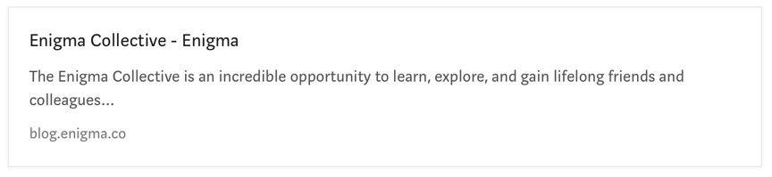

### 6. Enigma的未来

Enigma此前[已宣布](https://blog.enigma.co/expanding-enigmas-roadmap-towards-a-privacy-layer-for-the-decentralized-web-f1d6b7908251)了一系列公开发布版本的计划，每个发布都为我们的协议增加了额外的功能。这始于我们在2018年6月发布的初始测试网，接下来就是我们即将要发布的Discovery。 （阅读[更多](https://blog.enigma.co/expanding-enigmas-roadmap-towards-a-privacy-layer-for-the-decentralized-web-f1d6b7908251)关于扩展Enigma的路线图。）

**Discovery**引入了**“Secret Contracts 1.0”**，它将允许对整个计算状态进行完全加密。这将使得dApp开发人员能够在其智能合约中包含敏感数据，而无需依赖中心化（且安全性较低）的链下系统。 Discovery引入了网络节点和节点奖励，并且还允许Enigma的核心虚拟机（我们的计算引擎）支持WASM。这使得大多数需要的oracle功能已经内置到Enigma中，并且为我们想要实现的任何隐私保护技术提供了一个通用的计算引擎。

**Voyager**是我们的第二个主要发行，它专注于为dApps提供更强大的隐私保护。这将使用新的分布式VM，允许运行通用的安全多方计算（MPC）。这将允许开发人员在他们的隐私合约中选择不同的执行引擎--TEE（Secret Contracts 1.0）或MPC（Secret Contracts 2.0）。
Valiant将在Enigma链中引入一个完全开放和安全的共识，同时通过使用更精细的分片来提高性能。

**Defiant**带来完全的链独立性。Enigma网络将完全独立于其他网络来运行其内部Enigma链。在此版本中，我们还将发布加密协议（主要围绕MPC）的主要更新，这些更新都会增加安全性和分布性。Defiant是Enigma的权威“training-wheels-off”阶段。

Defiant版本绝不是我们旅程的终结。这只是迈向我们使命的一个关键步骤--即发展和改进Enigma、扩展我们的开发人员社区、实现全球的协议采用、以及解决关于隐私和真正去中心化的一些最大的世界性挑战。

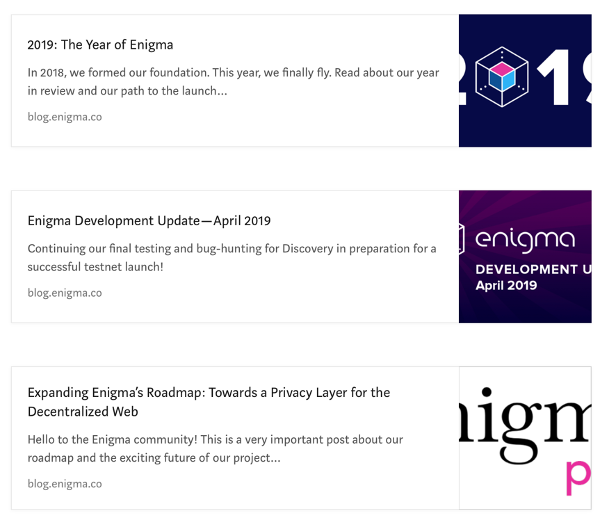

### 7. Decentralize This！播客节目

考虑到我们对社区的教育义务，我们希望探索那些阻碍去中心化技术被广泛采用的困难——同时强调协作对实现去中心化未来这个共同目标的重要性。
“Decentralize This！”是一个播客节目，集中了去中心化领域的诸多嘉宾：有开发者、投资者、企业家、研究人员、作家、艺术家和政府人员——那些真正对建立一个更加去中心化和可持续发展的世界关心的个体。我们要回答的问题是：**所有具有不同观点的人如何进行合作来创造和发展所需技术，从而塑造更美好的未来？**

收听[Spotify](https://open.spotify.com/show/1TIx9MAFdaQidDVz32EacG)，[iTunes](https://podcasts.apple.com/us/podcast/decentralize-this/id1438776388?mt=2)，[SoundCloud](https://soundcloud.com/decentralize-this)，或访问我们在Medium上的播客[landing page](https://blog.enigma.co/podcast/home)。

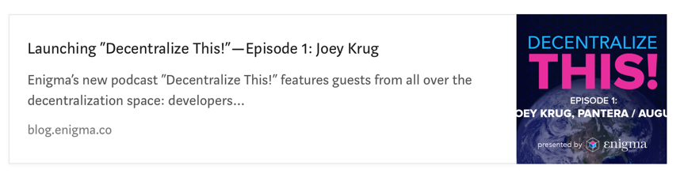
  

### 8. 我该如何关注Enigma项目？

我们很乐意让您加入社区，跟上我们的进步和发展。我们致力于提高透明度，并希望让社区成员与Enigma互动并做出贡献。我们很想听听您的意见并回答您的问题。

**官方频道：**

Enigma网站：[https://enigma.co/](https://enigma.co/)

Medium: [https://blog.enigma.co](https://blog.enigma.co)  
telegram：[https://t.me/EnigmaProject](https://t.me/EnigmaProject)  
Twitter：[https://twitter.com/EnigmaMPC](https://twitter.com/EnigmaMPC)  
Reddit：[https://reddit.com/r/EnigmaProject](https://reddit.com/r/EnigmaProject)  
YouTube：[https://www.youtube.com/channel/UCyyl1qq8o7uIKd9caF1fanw](https://www.youtube.com/channel/UCyyl1qq8o7uIKd9caF1fanw)  
Enigma开发者论坛：[https://forum.enigma.co/](https://forum.enigma.co/)

[info@enigma.co](info@enigma.co)

感谢您对Enigma的关注。如果您加入我们，创建一个更加去中心化、可持续的、共同协作的未来，我们将感到很荣幸。我们很乐意帮助您在我们这个由建设者、学习者和梦想家构成的社区里找到一个家。

我们将共同创造我们想要的未来。

Enigma团队

