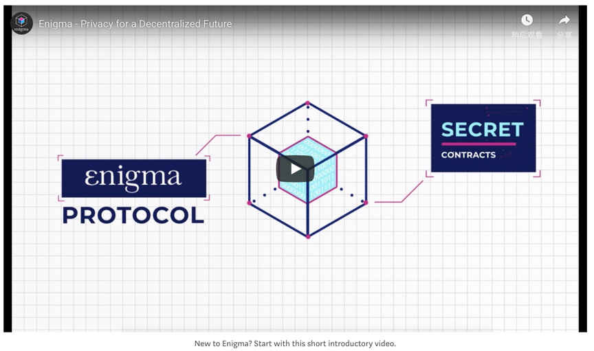

## 欢迎来到Enigma！从这里开始.
原文：[Welcome to Enigma! Start Here.](https://blog.enigma.co/welcome-to-enigma-start-here-e65c8c9125ef)  
翻译：王兵、高天尧、程冠杰  
校对：李其柄

在Enigma中，我们正努力实现去中心化互联网的愿景。 这份介绍指南完整地阐述了Enigma项目的发展和我们团队的相关信息。

  
欢迎来到Enigma博客！无论您是从2015年的最初阶段开始关注到了我们的项目，还是从现在开始学习Enigma的隐私方案，我们都希望您能够轻松搜索我们的文章、资源和代码。

在这篇博文中，您将可以看到有关Enigma所有内容的目录，例如团队和代币分发情况。我们还将分享一些资源帮助您追踪和参与到我们的项目、协议和社区。 Enimga团队将不断维护更新这篇博文和文档目录。

 

[[video](https://www.youtube.com/watch?v=qeJn8YgDIlw)]

  
### 目录

- [什么是Enigma协议以及它如何工作？](#id1)

- [你能用Enigma构建什么？](#id2)

- [Enigma节点和ENG代币](#id3)

- [Enigma的隐私技术](#id4)

- [团队、社区和Enigma Collective](#id5)

- [Enigma的未来](#id6)

- [Decentralize This！博客节目](#id7)

### 1. 什么是Enigma协议以及它如何工作？

### 2. 你能用Enigma构建什么？

#### 2.1 如何用Enigma构建隐私应用？

#### 2.2 不断增长的Enigma生态

### 3. Enigma节点和ENG代币

### 4. Enigma的隐私技术

### 5. 团队、社区和Enigma Collective

自我们的团队成立以来，越来越多的人认识到隐私可以帮助构建一个更美好的未来。作为一个团队和一个社区，我们有责任向广大公众传授为什么创建新的数据隐私解决方案如此重要，以及为什么我们必须抵制那些利用其用户行为而不是返回价值的过度集中化的组织机构。借助一些创新技术，我们可以共同构建我们所向往的去中心化的未来。
我们的团队由经验丰富的开发人员和企业家组成，其中许多人以前是麻省理工学院（我们项目开始的地方）的研究生，研究人员和教育工作者。我们在分布式技术以及数据科学和数据隐私方面拥有深厚的专业知识。您可以亲眼看到我们的团队成长和壮大的速度有多迅猛！

在Epicenter interview和CoinTelegraph interview中聆听我们的首席执行官和联合创始人Guy Zyskind谈论Enigma以及他的相关工作。

我们在Enigma有很多公共社区，从我们的Telegram小组到我们的Reddit，再到我们的开发者论坛。
Enigma社区的核心是Enigma Collective。他们是一个惊人的（并且正在快速增长！）几乎分布在世界每个时区的不同区块链群体，比如区块链爱好者、开发者、作家、设计师、企业家、投资者以及诗人和哲学家，他们所有人都致力于实现一个类似Enigma的真正去中心化的世界。其中超过50个来自15个国家的Collective成员担任教育工作者和策划者，他们直接与Enigma核心团队合作，帮助我们驱动和实现Enigma的使命。
我们之前发布过一些Enigma Collective活跃成员的个人资料，包括Kristi，Brendan和Josh。在此处了解有关该计划的更多信息，如果您想加入Collective，请在此处申请！

### 6. Enigma的未来

Enigma此前已宣布了一系列计划的公开发布，每个发布都为我们的协议增加了额外的功能。这始于我们在2018年6月发布的初始测试网，接下来就是我们即将要发布的Discovery。 （阅读更多关于扩展Enigma的路线图。）
Discovery引入了“Secret Contracts 1.0”，它将允许对整个计算状态进行完全加密。这将使得dApp开发人员能够在其智能合约中包含敏感数据，而无需依赖集中式（且安全性较低）的链下系统。 Discovery引入了网络节点和节点奖励，并且还允许Enigma的核心虚拟机（我们的计算引擎）支持WASM。这使得大多数需要的oracle功能已经内置到Enigma中，并且为我们想要实现的任何隐私保护技术提供了一个通用的计算引擎。
Voyager是我们的第二个主要发行，它专注于为dApps提供更强大的隐私保护。这将使用新的分布式VM，允许运行通用的安全多方计算（MPC）。这将允许开发人员在他们的机密合约中选择不同的执行引擎--TEE（Secret Contracts 1.0）或MPC（Secret Contracts 2.0）。
Valiant将在Enigma链中引入一个完全开放和安全的共识，同时通过使用更精细的分片来提高性能。

Defiant带来完全的链独立性。Enigma网络将完全独立于其他网络运行其内部Enigma链。在此版本中，我们还将发布加密协议（主要围绕MPC）的主要更新，这些更新都会增加安全性和分布性。Defiant是Enigma的权威“训练轮关”阶段。
Defiant版本绝不是我们旅程的终结。这只是迈向我们使命的另一个关键步骤——发展和改进Enigma扩展我们的开发人员社区，实现全球采用，以及解决世界上对隐私和真正去中心化的一些最大挑战。

### 7. Decentralize This！博客节目

作为我们对社区的教育责任的一部分，我们希望探索那些阻碍了分布式技术被广泛采用的困难——同时强调协作对实现一个分布式未来的共同目标的重要性。
“分散这个！”是一个播客，集中了来自所有分布式领域的嘉宾：有开发商，投资者，企业家，研究人员，作家，艺术家，政府和企业人员——所有对建立一个更加分布和可持续发展的世界非常关心的个体。我们要回答的问题是：所有具有不同观点的人如何进行合作来创造和扩展塑造更美好的未来所需的技术？
收听Spotify，iTunes，SoundCloud上的每一集，或访问我们在Medium上的播客登录页面。

  

